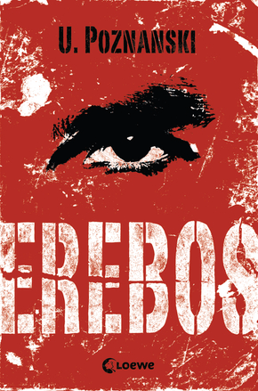

# Erebos

## Buch Präsentation

---

## Inhalt

- TODO
- TODO

---

## Autorin

Name: Ursula Poznanski
Geboren am: 30.10.1968
Arbeitete 1996-2012 als Medizinjournalistin.
Das erste Buch "Buchstabendschungel" brachte sie 2003 raus.
Ihr erster großer Erfolg war Erebos in 2010.
Schreibt hauptsächlich Thriller für Jugendliche (bei Loewe Verlag) und Erwachsene (bei Wunderlich und Knaur)

---

## Das Buch Erebos

Genre: Thriller
Erscheinungsjahr: 2010
Zielgruppe: Jugendliche & junge Erwachsene
Verlag: Loewe Verlag
Seiten: 482
Gewann den Deutschen Jugendliteraturpreis 2011
Der Nachfolger Erebos 2 erschien 2019 und spielt 10 Jahre nach Erebos 1
Thema: *An der Londoner Schule des Protagonisten Nick wird das Videospiel Erebos herumgereicht. Es gibt einem Aufgaben, welche man in der Realität erfüllen muss.*

---

## Wichtige Charaktere am Anfang

### Nick

Protagonist der Geschichte, 16 Jahre alt, groß, lange Haare.
Ist sehr interessiert an Erebos und möchte darüber erfahren.

### Brynne

Mitschülerin von Nick, hat Interesse an ihm und gibt ihm die Erebos-DVD.

### Emily

Mitschülerin von Nick, ist negativ gegenüber Erebos eingestellt.
Nick ist in Emily verliebt.

---

## Bevor Nick Erebos bekommt

Nicks Freund Colin taucht nicht mehr zum Basketball Training oder zur Schule auf. In der Schule werden Päckchen herumgereicht. Es ist merkwürdig.
Nick sieht wie sein Mitschüler Rashid Emily ein quadratisches Päckchen anbietet. Rashid versucht sie zu überzeugen, sie hat allerdings kein Interesse.
Brynne gibt Nick später die DVD für Erebos und erklärt ihm die Regeln.

---

## Die Regeln

* Man hat nur eine Chance. Wenn man stirbt, kann man nicht noch einmal von vorne anfangen.
* Wenn du spielst, musst du alleine sein.
* Erwähne im Spiel nie deinen richtigen Namen.
* Erwähne ausserhalb des Spiels nie den Namen deines Charakters.
* Der Inhalt des Spiels ist geheim. Sprich mit niemandem darüber.
* Bewahre die DVD sicher auf. Kopiere sie nur, wenn der Bote dich dazu auffordert.

---

## Das Spiel Erebos

* MMORPG (wie z.B. WoW)
* Charaktererstellung mit Völkern (Vampire, Dunkelelfen, ...) und Beruf (Ritter, Magier, ...)
* Man kann sich mit NPCs unterhalten als wären sie ChatGPT
* Man kann sich mit Spielern nur in Städten und an Lagerfeuern unterhalten
* "Der Bote" agiert wie ein Game Master. Er gibt Belohnungen nach Kämpfen und vergibt Aufträge.
* Aufträge können auch in der echten Welt stattfinden
* Gute Grafik und macht süchtig

---

## Was finde ich interessant?

- Inhalt ist (bis auf DVDs) noch aktuell

---

## Quellen

- <https://ursula-poznanski.de/>
- <https://www.loewe-verlag.de>
- <https://erebos.fandom.com/de/wiki/Erebos_Wiki>

---

## Nerd Zeug

Source ist auf [github.com/MoeDevelops/erebos](https://github.com/MoeDevelops/erebos)

- Präsentation mit **Marp** in **VSCode** gemacht
- Wird über eine **GitHub Action** als **Docker Image** gebaut
- Image wird in der **GitHub Container Registry** veröffentlicht
- Server holt sich das neue Image mit **WatchTower**
- Server startet **Docker Container** mit neuem Image neu

Theme: Catppuccin
Font: FiraCode Nerd Font

<meta name="darkreader-lock" />

---

## Ende

### Noch Fragen?
